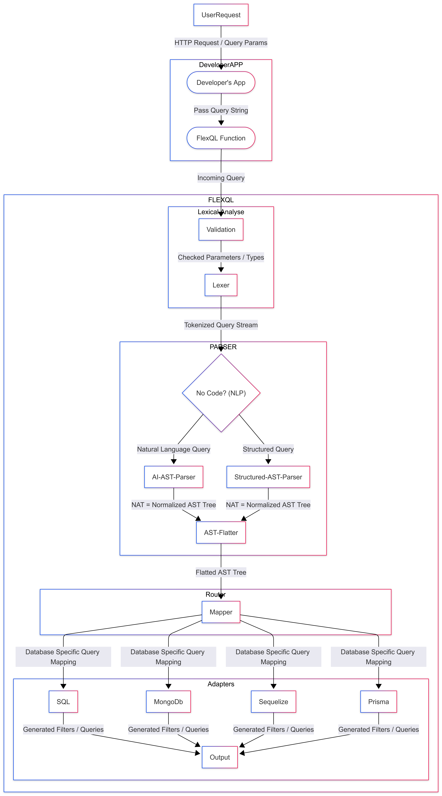

---
# 🧩 FlexQL
A lightweight **query language engine** for building filters **without writing complex SQL or ORM queries**.
<p align="center">

</p>
---

# 🚀 Overview

**FlexQL** lets you write readable and compact queries, which are parsed and converted into **database-specific formats** like SQL or Sequelize.
Instead of manually building queries, you can write:

```
username=="heja";age>18,status=="active"
```

Which means:

```
(username == "heja" AND age > 18) OR (status == "active")
```

> ⚠️ **Note:** Do **not use spaces** in the query string as separators. Use `;` for AND and `,` for OR.

---

# ✨ Features

- 🧠 **Readable syntax** — intuitive query format
- 🔀 **Flexible separators** — `;` = AND, `,` = OR
- 🔒 **Safe** — parameterized output to prevent SQL injection
- ⚙️ **Adapter-based** — SQL, Sequelize, MongoDB (coming), Elasticsearch (coming)
- 🧱 **Lexer → Parser → Adapter** — modular and extensible
- 🧪 **Type-validated** — automatically checks numbers, strings, booleans
- 🧰 **Easy to extend** — add new adapters or operators quickly

---

# ⚙️ How FlexQL Works

```
Query String
     ↓
  Lexer → tokens
     ↓
  Parser → AST (Abstract Syntax Tree)
     ↓
  Adapter → SQL / Sequelize / MongoDB
```

---

# 🌳 AST Example

### Query

```
username=="heja";age>18,status=="active"
```

### Generated AST (simplified)

```json
{
  "type": "OR",
  "children": [
    {
      "type": "AND",
      "children": [
        { "field": "username", "operator": "==", "value": "heja" },
        { "field": "age", "operator": ">", "value": 18 }
      ]
    },
    { "field": "status", "operator": "==", "value": "active" }
  ]
}
```

> FlexQL builds a structured query, not just parses a string.

---

# 🧱 Adapter Outputs

## 🔹 SQL Adapter

### Basic filter — single AND chain

```
username=="heja";age>18;country=="NL"
```

```js
{
  type: 'sql',
  payload: {
    conditions: 'WHERE username = ? AND age > ? AND country = ?',
    values: ['heja', 18, 'NL']
  }
}
```

**Usage:**

```ts
import { FlexQL } from "flexql";
import db from "./db"; // your database connection

const result = FlexQL.parse('username=="heja";age>18;country=="NL"', {
  adapter: "sql",
});

const rows = await db.query(
  `SELECT * FROM users ${result.payload.conditions}`,
  result.payload.values,
);
```

---

### Mixed AND/OR — user search with fallback

```
username=="heja";age>18,status=="active"
```

```js
{
  type: 'sql',
  payload: {
    conditions: 'WHERE username = ? AND age > ? OR status = ?',
    values: ['heja', 18, 'active']
  }
}
```

**Usage:**

```ts
const result = FlexQL.parse('username=="heja";age>18,status=="active"', {
  adapter: "sql",
});

const users = await db.query(
  `SELECT * FROM users ${result.payload.conditions}`,
  result.payload.values,
);
```

---

### Date range filter

```
created_at>="2025-01-01";created_at<="2025-12-31";active==true
```

```js
{
  type: 'sql',
  payload: {
    conditions: 'WHERE created_at >= ? AND created_at <= ? AND active = ?',
    values: ['2025-01-01', '2025-12-31', true]
  }
}
```

**Usage:**

```ts
const result = FlexQL.parse(
  'created_at>="2025-01-01";created_at<="2025-12-31";active==true',
  { adapter: "sql" },
);

const logs = await db.query(
  `SELECT * FROM audit_logs ${result.payload.conditions} ORDER BY created_at DESC`,
  result.payload.values,
);
```

✅ **Safe and parameterized** — values are never interpolated into the query string.

---

## 🔹 Sequelize Adapter

### Multi-country OR filter

```
username=="heja",country=="NL";score>90,rank>=5;active==true,verified==true
```

```js
{
  type: 'sequelize',
  payload: {
    conditions: {
      [Op.and]: [
        {
          [Op.or]: [
            { username: 'heja' },
            { country: 'NL' }
          ]
        },
        {
          [Op.or]: [
            { score: { [Op.gt]: 90 } },
            { rank: { [Op.gte]: 5 } }
          ]
        },
        {
          [Op.or]: [
            { active: true },
            { verified: true }
          ]
        }
      ]
    }
  }
}
```

**Usage:**

```ts
import { FlexQL } from "flexql";
import { User } from "./models";

const result = FlexQL.parse(
  'username=="heja",country=="NL";score>90,rank>=5;active==true,verified==true',
  { adapter: "sequelize" },
);

const users = await User.findAll({
  where: result.payload.conditions,
});
```

---

### Admin dashboard — dynamic filter from query params

```
role=="admin",role=="moderator";banned==false;last_login>="2025-06-01"
```

```js
{
  type: 'sequelize',
  payload: {
    conditions: {
      [Op.and]: [
        {
          [Op.or]: [
            { role: 'admin' },
            { role: 'moderator' }
          ]
        },
        { banned: false },
        { last_login: { [Op.gte]: '2025-06-01' } }
      ]
    }
  }
}
```

**Usage:**

```ts
// req.query.filter = 'role=="admin",role=="moderator";banned==false;last_login>="2025-06-01"'
const result = FlexQL.parse(req.query.filter, { adapter: "sequelize" });

const admins = await User.findAll({
  where: result.payload.conditions,
  order: [["last_login", "DESC"]],
});
```

---

### Paginated product listing

```
category=="electronics";price>=100;price<=999;in_stock==true
```

```js
{
  type: 'sequelize',
  payload: {
    conditions: {
      [Op.and]: [
        { category: 'electronics' },
        { price: { [Op.gte]: 100 } },
        { price: { [Op.lte]: 999 } },
        { in_stock: true }
      ]
    }
  }
}
```

**Usage:**

```ts
const result = FlexQL.parse(
  'category=="electronics";price>=100;price<=999;in_stock==true',
  { adapter: "sequelize" },
);

const products = await Product.findAndCountAll({
  where: result.payload.conditions,
  limit: 20,
  offset: page * 20,
});
```

---

# 🔤 Syntax Reference

| Element        | Description        | Examples                         |
| -------------- | ------------------ | -------------------------------- |
| **Identifier** | Column / field     | `username`, `age`                |
| **Operator**   | Comparison         | `==`, `!=`, `>`, `<`, `>=`, `<=` |
| **Logic**      | Combine conditions | `;` = AND, `,` = OR              |
| **Value**      | Match value        | `"heja"`, `18`, `true`           |

---

# 🧩 Example Queries

### Basic

```
username=="test";age>10
```

```
username=="test",status==false
```

### Medium

```
age>=18;(country=="TR",country=="DE");premium_user==true
```

```
score>50,rank>=3;active==true,verified==true
```

### Complex

```
username=="heja",country=="NL";score>90,rank>=5;active==true,verified==true;created_at>="2025-01-01";updated_at<="2025-10-01",last_login>="2025-09-01"
```

---

# 📦 Installation & Usage

> 🚧 **Coming Soon** — FlexQL will be available on npm shortly. Stay tuned!

```bash
npm install flexql
```

```ts
import { FlexQL } from "flexql";
const query = 'username=="heja";age>18;country=="NL"';
const result = FlexQL.parse(query, { adapter: "sequelize" });
console.log(result.payload.conditions);
```

---

# 💡 Why FlexQL?

- ✅ **Readable and compact queries**
- 🧱 **Works across multiple databases**
- 🧠 **Logical precedence support** — AND > OR
- 🔒 **Safe parameterized output**
- 🌍 **Portable architecture** via adapters
- 🧩 **Modular & extensible**

---

# 🧑‍💻 Use Cases

- Admin dashboards with dynamic filters
- API query parameter parsing
- ORM-independent rule engines
- Safe filtering for user input

---

# 🧭 Roadmap

- [x] SQL adapter
- [x] Sequelize adapter
- [ ] MongoDB adapter
- [ ] Elasticsearch adapter
- [ ] Nested query support
- [ ] Type inference & validation
- [ ] Query optimizer
- [ ] FlexQL Playground

---

# ⚖️ License

MIT License © 2025 **Heja "xeja" Arslan**
